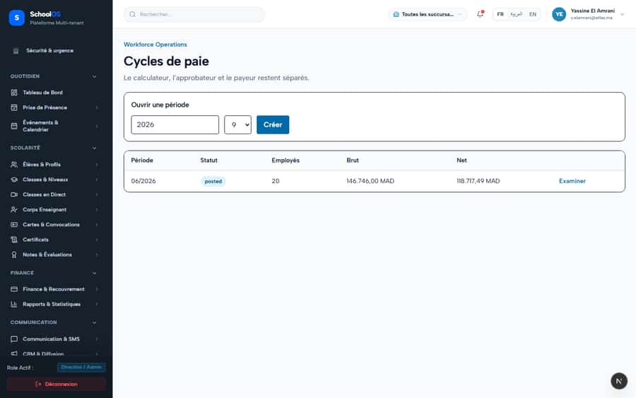

# `/dashboard/workforce/payroll/runs`

**Status: NEEDS FIX (P3)** · Module: `workforce` · Source: [`src/app/[locale]/(dashboard)/dashboard/workforce/payroll/runs/page.tsx`](<../../../../../src/app/[locale]/(dashboard)/dashboard/workforce/payroll/runs/page.tsx>)

**Progress (2026-09-23):** S-53 DONE · S-57 OPEN

Guard: `requireServerPage` · capability `payroll.review`

**Verdict:** 2 finding(s), worst P2. 3 sweep run(s): 3 clean or expected, 0 flagged. 3 screenshot(s).

## Findings on this page

| ID | Sev | Problem | Fix | Code now |
|---|---|---|---|---|
| [S-53](../../findings/done/S-53.md) | P2 | Salary payment batches skip the RIB check; no bank export | Block or flag `bank_transfer` lines with no RIB; build the Moroccan bank transfer export or drop the claim from AGENTS.md. | STILL OPEN |
| [S-57](../../findings/S-57.md) | P3 | Raw enum values, two money formats, stale "current" year, overlapping widget | Translate enums; one MAD formatter; check active year; move the widget. | Not re-checked since the sweep. |

## Sweep results

| Pass | Role | URL tested | Result |
|---|---|---|---|
| Pass A | accountant | `/dashboard/workforce/payroll/runs` | expected: → /fr/dashboard/finance (denied, sent to the role's own home; fine unless the sidebar shows this link, see S-32) |
| Pass A | school_admin | `/dashboard/workforce/payroll/runs` | expected: → /fr/dashboard/settings/entitlements (add-on off or access denied, correct gating) |
| Pass B | school_admin | `/dashboard/workforce/payroll/runs` | ok |

## Screenshots

**Pass A · main DB (:3111/:3222), 2026-09-22/23** · accountant · fr · `/dashboard/workforce/payroll/runs`

**Pass A · main DB (:3111/:3222), 2026-09-22/23** · school_admin · fr · `/dashboard/workforce/payroll/runs`

**Pass B · seeded audit DB, all add-ons, 2026-09-23** · school_admin · fr · `/dashboard/workforce/payroll/runs`

## Plan

- [ ] **S-53 (P2)** Salary payment batches skip the RIB check; no bank export
  - [ ] Validation in the POST.
  - [ ] Export format (decide with finance).
  - [ ] Test: no-RIB employee blocks or flags the batch.
  - [ ] Accept: No bank batch silently includes a no-RIB employee.
- [ ] **S-57 (P3)** Raw enum values, two money formats, stale "current" year, overlapping widget
  - [ ] Enum label maps.
  - [ ] Single formatter.
  - [ ] Accept: No raw enum values on these pages.
- [ ] Re-run this page: `echo "/dashboard/workforce/payroll/runs" > r.txt && AUDIT_BASE=http://localhost:3333 node scripts/visual-sweep.mjs accountant r.txt`

## Cross-cutting findings that also show here

- [S-7](../../findings/S-7.md) (P1) ~1 375 hardcoded French UI strings bypass translation (Arabic UI stays French)
- [S-14](../../findings/S-14.md) (P2) Sidebar lists add-on modules the tenant has not enabled
- [S-18](../../findings/done/S-18.md) (P1) Header claims CNDP compliance on every page; the school has not filed
- [S-25](../../findings/done/S-25.md) (P2) Header shows a fake identity when the session call is slow
- [S-37](../../findings/S-37.md) (P2) Arabic: dashboard widgets stay French; brand renders "OSSchool" in RTL
- [S-41](../../findings/done/S-41.md) (P1) Auth rate limit counts every page's session check, per IP
