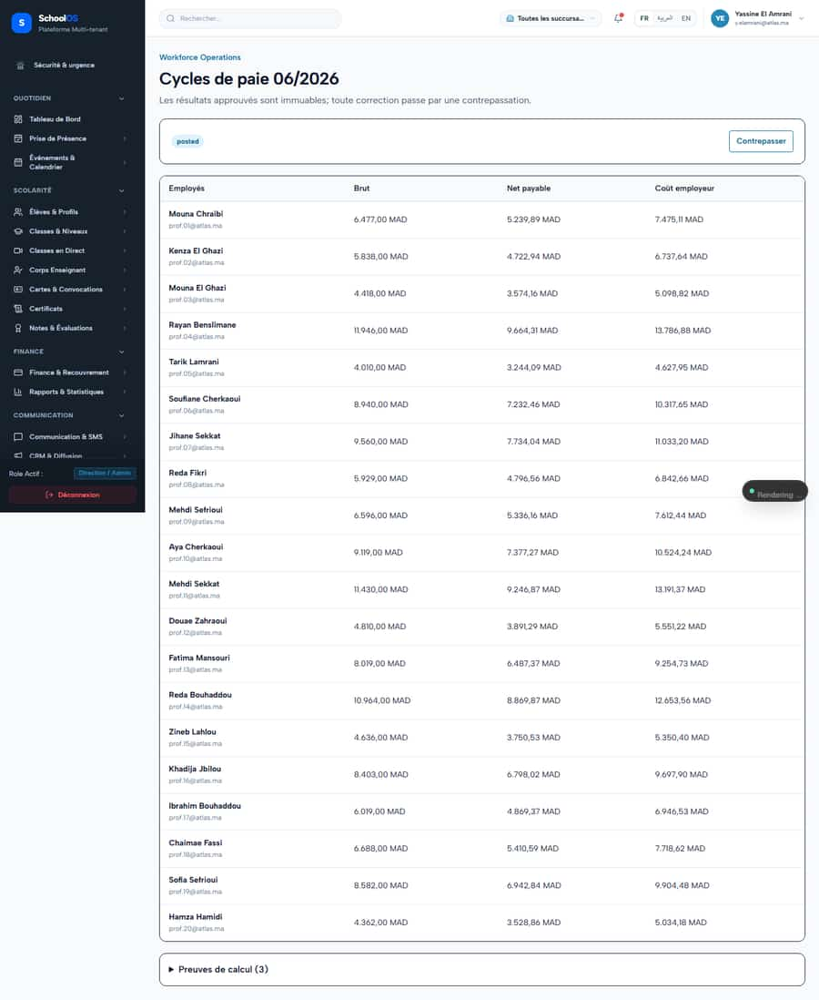
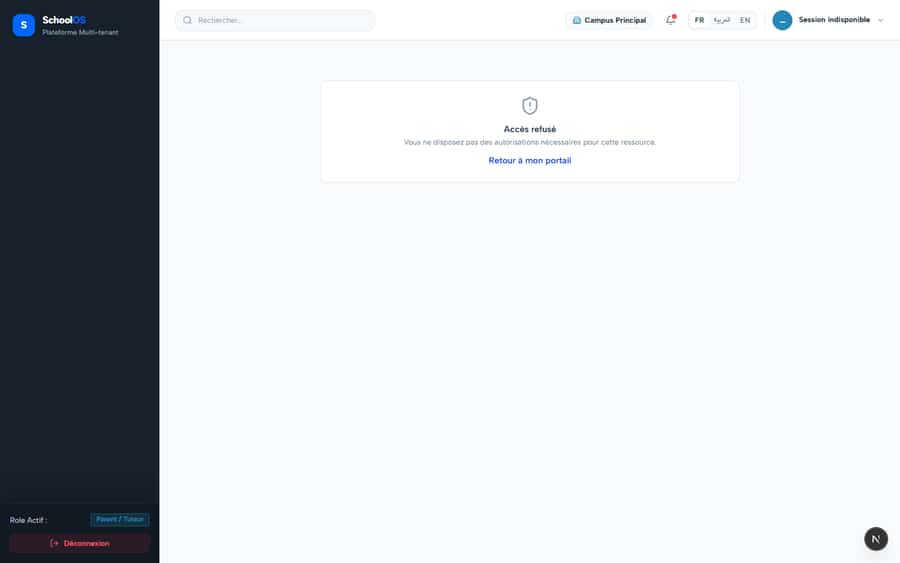

# `/dashboard/workforce/payroll/runs/[id]`

**Status: FIXED, pending re-sweep** · Module: `workforce` · Source: [`src/app/[locale]/(dashboard)/dashboard/workforce/payroll/runs/[id]/page.tsx`](<../../../../../src/app/[locale]/(dashboard)/dashboard/workforce/payroll/runs/[id]/page.tsx>)

**Progress (2026-09-25):** S-53 DONE

Guard: `requireServerPage` · capability `payroll.review`

**Verdict:** 1 finding(s), worst P2. 2 sweep run(s): 1 clean or expected, 1 flagged. 2 screenshot(s).

## Findings on this page

| ID | Sev | Problem | Fix | Code now |
|---|---|---|---|---|
| [S-53](../../findings/done/S-53.md) | P2 | Salary payment batches skip the RIB check; no bank export | Block or flag `bank_transfer` lines with no RIB; build the Moroccan bank transfer export or drop the claim from AGENTS.md. | STILL OPEN |

## Sweep results

| Pass | Role | URL tested | Result |
|---|---|---|---|
| Pass C | school_admin | `/dashboard/workforce/payroll/runs/5b2ef4a1-514b-4dd9-abc6-f03d74db1ce8` | ok |
| Pass C | parent | `/dashboard/workforce/payroll/runs/5b2ef4a1-514b-4dd9-abc6-f03d74db1ce8` | ok, blocked → /fr/dashboard/access-denied **S-41**: 429 /api/auth/get-session **S-41**: 429 rate-limited ok, 403 /api/settings/branches (data blocked, expected) |

## Screenshots

**Pass C · detail + public pages, 2026-09-23** · school_admin · fr · `/dashboard/workforce/payroll/runs/5b2ef4a1-514b-4dd9-abc6-f03d74db1ce8`

**Pass C · parent typing staff URLs (expected: blocked)** · parent · fr · `/dashboard/workforce/payroll/runs/5b2ef4a1-514b-4dd9-abc6-f03d74db1ce8`

## Plan

- [ ] **S-53 (P2)** Salary payment batches skip the RIB check; no bank export
  - [ ] Validation in the POST.
  - [ ] Export format (decide with finance).
  - [ ] Test: no-RIB employee blocks or flags the batch.
  - [ ] Accept: No bank batch silently includes a no-RIB employee.
- [ ] Re-run this page: `echo "/dashboard/workforce/payroll/runs/5b2ef4a1-514b-4dd9-abc6-f03d74db1ce8" > r.txt && AUDIT_BASE=http://localhost:3333 node scripts/visual-sweep.mjs parent r.txt`

## Cross-cutting findings that also show here

- [S-41](../../findings/done/S-41.md) (P1) Auth rate limit counts every page's session check, per IP
- [S-7](../../findings/S-7.md) (P1) ~1 375 hardcoded French UI strings bypass translation (Arabic UI stays French)
- [S-14](../../findings/done/S-14.md) (P2) Sidebar lists add-on modules the tenant has not enabled
- [S-18](../../findings/done/S-18.md) (P1) Header claims CNDP compliance on every page; the school has not filed
- [S-25](../../findings/done/S-25.md) (P2) Header shows a fake identity when the session call is slow
- [S-37](../../findings/S-37.md) (P2) Arabic: dashboard widgets stay French; brand renders "OSSchool" in RTL
- [S-44](../../findings/done/S-44.md) (P2) Staff campus switcher renders for parents, students and super admin (403 on every page)
