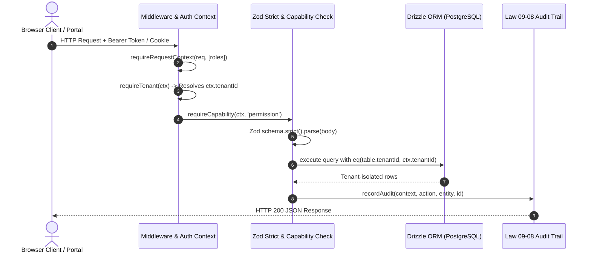
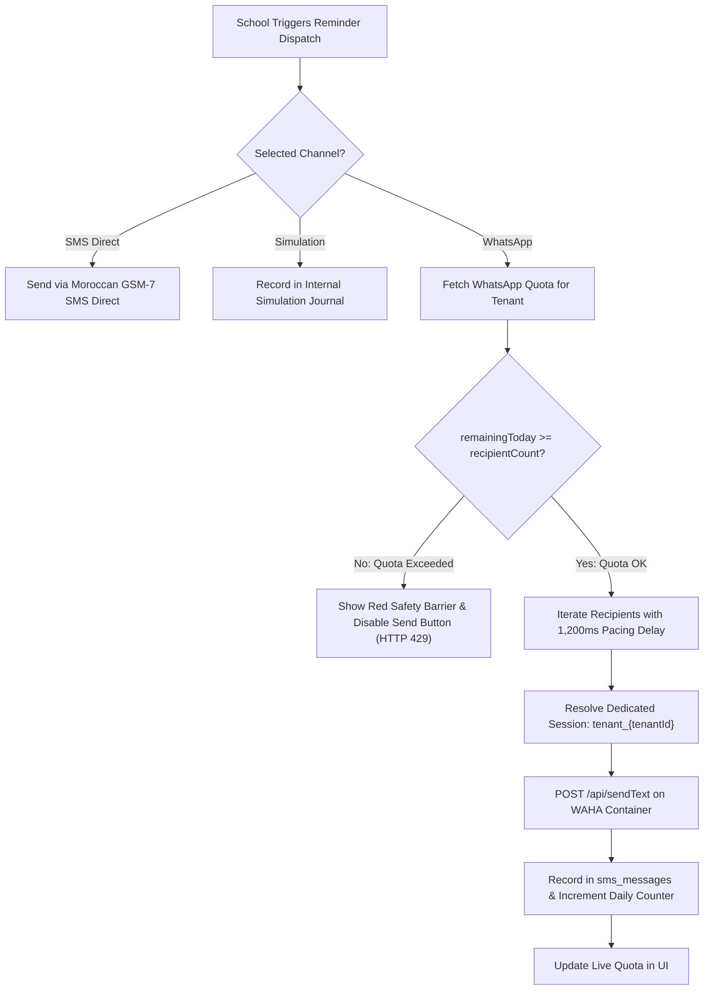
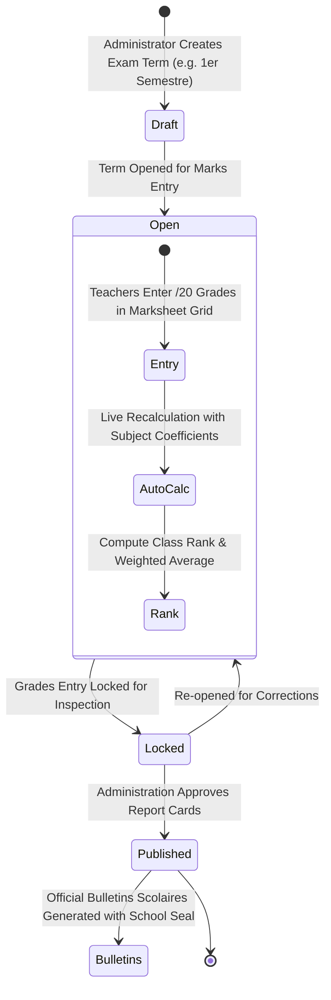
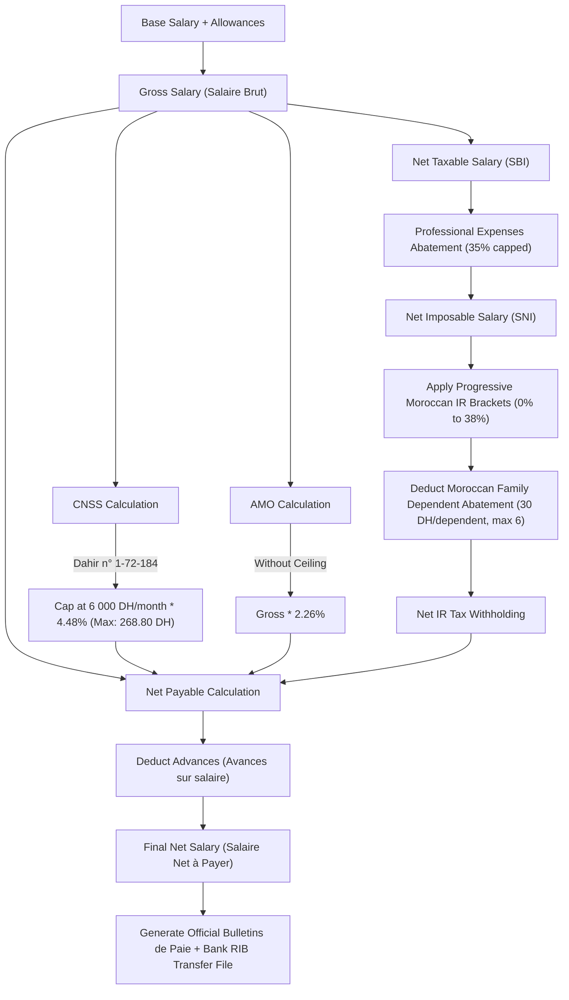

# 🗺️ SchoolOS Architectural & Relational Diagrams

This document contains Mermaid diagrams illustrating the core workflows, security pipelines, and subsystem relationships in SchoolOS.

---

## 1. High-Level Subsystem Topology

```mermaid
graph TD
    classDef core fill:#2487B8,stroke:#1B6C93,stroke-width:2px,color:#fff;
    classDef tenant fill:#059669,stroke:#047857,stroke-width:2px,color:#fff;
    classDef ext fill:#D97706,stroke:#B45309,stroke-width:2px,color:#fff;

    SA["Super Admin Platform"]:::core
    T["Tenant (School / Centre)"]:::tenant

    SA -->|Provisions & Subscriptions| T

    subgraph "Core Subsystems (Single PostgreSQL partitioned by tenant_id)"
        ACAD["Academics & Timetable"]:::tenant
        ASSESS["Assessment & /20 Grades"]:::tenant
        STUD["Students & Admissions"]:::tenant
        PAR["Parents & Guardians"]:::tenant
        FIN["Finance & Cashier POS"]:::tenant
        HR["HR & Staff Registry"]:::tenant
        WF["Workforce & Moroccan Payroll"]:::tenant
        COMM["Broadcast & Reminders"]:::tenant
        TRANS["Transport & Fleet"]:::tenant
        DOC["Document Studio & Seal"]:::tenant
    end

    T --> ACAD
    T --> ASSESS
    T --> STUD
    T --> PAR
    T --> FIN
    T --> HR
    T --> WF
    T --> COMM
    T --> TRANS
    T --> DOC

    subgraph "External Integrations"
        WAHA["WhatsApp WAHA Engine"]:::ext
        SMS["Moroccan Telcos (GSM-7)"]:::ext
        MASSAR["Massar (MEN)"]:::ext
        CMI["CMI / Stripe Gateway"]:::ext
        CAD["Caddy Reverse Proxy"]:::ext
    end

    COMM -->|Multi-Session API| WAHA
    COMM -->|GSM-7 Segments| SMS
    ACAD -->|Roster & Grade Sync| MASSAR
    FIN -->|Card Webhooks| CMI
    CAD -->|SSL & Routing| T
```

---

## 2. Multi-Tenant Request Context Pipeline

---

## 3. WhatsApp Multi-Session & Meta Anti-Ban Engine

---

## 4. Moroccan /20 Grading & Exam Term Lifecycle

---

## 5. Moroccan Statutory Payroll Calculation Flow

